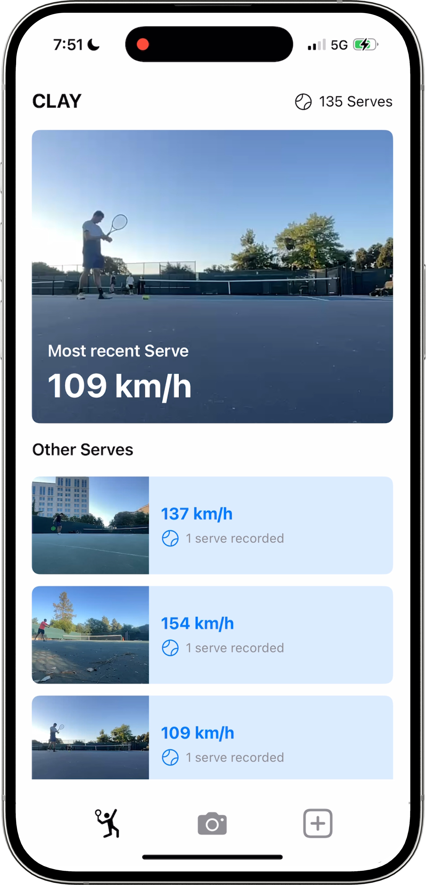

# ⚡ Serve Speed Estimation

An **on-device computer vision module** that tracks the ball trajectory of your tennis serve and computes **serve velocity in km/h** — directly on your iPhone.  
👉 [Watch the demo video here](https://youtu.be/GdJaosgI6JI?si=bANF1ydVb1aY-vH8).

  

---

## 🚀 Features

- **Ball trajectory tracking**  
  Uses Apple Vision’s `VNDetectTrajectoriesRequest` to detect and follow the tennis ball across frames

- **Real-time serve speed**  
  Computes serve velocity from trajectory length and frame timestamps, presented instantly as overlays

- **Noise filtering**  
  Applies parabolic filtering and confidence thresholds to ensure valid left-to-right, downward-facing serves only

- **On-device execution**  
  Runs fully on iOS devices (AVFoundation + Vision) with no server calls required

---

## 🏃‍♂️ Run it locally (iOS 16+)

### Prereqs
- **Xcode 14.3+** (iOS 16 SDK or newer)  
- **iPhone/iPad on iOS 16+** (recommended; trajectory detection works best on-device)  
- Apple Developer account for code signing  

### 1) Get the code and open in Xcode
- `git clone https://github.com/ChristianCadisch/Serve-speed-detector.git`
- Open in Xcode  
- Select the **ServeSpeedApp** scheme  

Add these keys if not present (Target → *Info*):
- `Privacy - Camera Usage Description` → *Needed to record and analyze your serve.*  
- `Privacy - Photo Library Usage Description` → *Needed to pick existing serve videos for analysis.*  

### 2) Code signing and developer mode
- Target → *Signing & Capabilities* → select your **Team**  
- Update **Bundle Identifier** (e.g., `com.yourname.servespeed`)  
- On iOS 16+: enable **Settings → Privacy & Security → Developer Mode → On** (device will reboot)  

### 3) Run on device
- Plug in your device (or use Wi-Fi debugging)  
- In Xcode, choose your device as the run target  
- **Run** (⌘R)  

### 4) Use the app
- Record a serve live or pick a video  
- The app overlays the **trajectory path** and shows your serve speed (km/h) in real time  

---

## 🧠 Technical Implementation

- **Trajectory detection**:  
  Implemented in [`ContentAnalysisViewController.swift`](./ContentAnalysisViewController.swift):contentReference[oaicite:1]{index=1}  
  - Uses `VNDetectTrajectoriesRequest` with frame spacing (1/60s) and minimum trajectory length  
  - Filters trajectories: left-to-right, high-to-low, parabolic curve, confidence > 0.6

- **Speed calculation**:  
  - Speed = `(distance / time)` → converted to km/h
  - Rounded and displayed immediately in the overlay (`serveSpeedLabel`)
  - Fastest serve per video is saved in `UserDefaults` for progress tracking  

- **Overlay rendering**:  
  - `TrajectoryView` draws the ball path and speed 
  - SwiftUI/UIView hybrid ensures frame-accurate overlays

- **Persistence**:  
  - Highest speed and per-video fastest speeds are persisted via `UserDefaults` 

---

## 📬 Contact

If you run into issues, have questions, or want to contribute, feel free to reach out:

- ✉️ Email: [christian.cadisch@gmail.com](mailto:christian.cadisch@gmail.com)  
- 💼 LinkedIn: [linkedin.com/in/cadisch](https://www.linkedin.com/in/cadisch)  
- 🐙 GitHub: [github.com/ChristianCadisch](https://github.com/ChristianCadisch)

---

## 🛠️ Roadmap

- [ ] Combine serve speed tracking with [technique feedback](https://github.com/ChristianCadisch/AI-serve-feedback) for integrated analysis  
- [ ] Improve UI
- [ ] Add connection to cloud for storing videos (e.g., Google Firebase)

